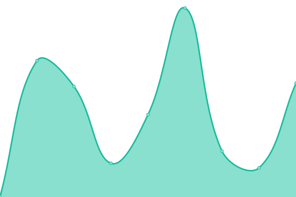
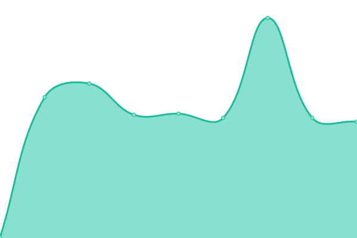
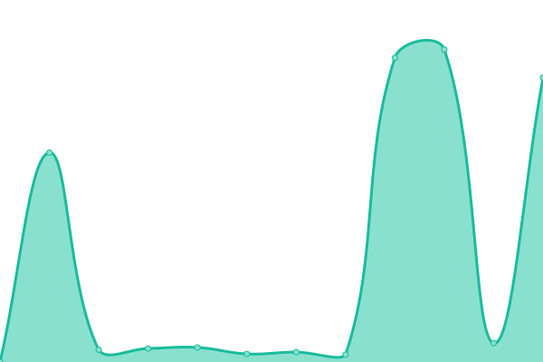

# [📈 Live Status](https://demo.upptime.js.org): <!--live status--> **🟩 All systems operational**

This repository contains the open-source uptime monitor and status page for [seanstaffiery.com](https://demo.upptime.js.org), powered by [Upptime](https://github.com/upptime/upptime).

With [Upptime](https://upptime.js.org), you can get your own unlimited and free uptime monitor and status page, powered entirely by a GitHub repository. We use [Issues](https://github.com/seanstaffiery.com/status.seanstaffiery.com/issues) as incident reports, [Actions](https://github.com/seanstaffiery.com/status.seanstaffiery.com/actions) as uptime monitors, and [Pages](https://demo.upptime.js.org) for the status page.

<!--start: status pages-->
<!-- This summary is generated by Upptime (https://github.com/upptime/upptime) -->
<!-- Do not edit this manually, your changes will be overwritten -->
<!-- prettier-ignore -->
| URL | Status | History | Response Time | Uptime |
| --- | ------ | ------- | ------------- | ------ |
|  [seanstaffiery.com](https://seanstaffiery.com) | 🟩 Up | [seanstaffiery-com.yml](https://github.com/SeanStaffiery/status.seanstaffiery.com/commits/HEAD/history/seanstaffiery-com.yml) | 

 111ms
     
 | 

<a href="https://status.seanstaffiery.com/history/seanstaffiery-com">22.48%</a>
    

|  [seanstaffiery.dev](https://seanstaffiery.dev) | 🟩 Up | [seanstaffiery-dev.yml](https://github.com/SeanStaffiery/status.seanstaffiery.com/commits/HEAD/history/seanstaffiery-dev.yml) | 

 134ms
     
 | 

<a href="https://status.seanstaffiery.com/history/seanstaffiery-dev">19.09%</a>
    

|  [thehosmers.com](https://thehosmers.com) | 🟩 Up | [thehosmers-com.yml](https://github.com/SeanStaffiery/status.seanstaffiery.com/commits/HEAD/history/thehosmers-com.yml) | 

 154ms
     
 | 

<a href="https://status.seanstaffiery.com/history/thehosmers-com">19.04%</a>
    

|  [projects.seanstaffiery.com](https://projects.seanstaffiery.com) | 🟩 Up | [projects-seanstaffiery-com.yml](https://github.com/SeanStaffiery/status.seanstaffiery.com/commits/HEAD/history/projects-seanstaffiery-com.yml) | 

 189ms
     
 | 

<a href="https://status.seanstaffiery.com/history/projects-seanstaffiery-com">0.00%</a>
    

|  [pgp.seanstaffiery.com](https://pgp.seanstaffiery.com) | 🟩 Up | [pgp-seanstaffiery-com.yml](https://github.com/SeanStaffiery/status.seanstaffiery.com/commits/HEAD/history/pgp-seanstaffiery-com.yml) | 

 89ms
     
 | 

<a href="https://status.seanstaffiery.com/history/pgp-seanstaffiery-com">0.00%</a>
    

|  [DigitalOcean](https://status.digitalocean.com) | 🟩 Up | [digital-ocean.yml](https://github.com/SeanStaffiery/status.seanstaffiery.com/commits/HEAD/history/digital-ocean.yml) | 

 196ms
     
 | 

<a href="https://status.seanstaffiery.com/history/digital-ocean">100.00%</a>
    

|  [Cloudflare](https://www.cloudflarestatus.com) | 🟩 Up | [cloudflare.yml](https://github.com/SeanStaffiery/status.seanstaffiery.com/commits/HEAD/history/cloudflare.yml) | 

 345ms
     
 | 

<a href="https://status.seanstaffiery.com/history/cloudflare">100.00%</a>
    

|  [Zoho](https://status.zoho.com) | 🟩 Up | [zoho.yml](https://github.com/SeanStaffiery/status.seanstaffiery.com/commits/HEAD/history/zoho.yml) | 

 510ms
     
 | 

<a href="https://status.seanstaffiery.com/history/zoho">100.00%</a>
    

|  [Microsoft Azure](https://status.azure.com/en-us/status) | 🟩 Up | [microsoft-azure.yml](https://github.com/SeanStaffiery/status.seanstaffiery.com/commits/HEAD/history/microsoft-azure.yml) | 

 265ms
     
 | 

<a href="https://status.seanstaffiery.com/history/microsoft-azure">100.00%</a>
    

|  [Google Cloud](https://status.cloud.google.com) | 🟩 Up | [google-cloud.yml](https://github.com/SeanStaffiery/status.seanstaffiery.com/commits/HEAD/history/google-cloud.yml) | 

 95ms
     
 | 

<a href="https://status.seanstaffiery.com/history/google-cloud">100.00%</a>
    

|  [Amazon Web Services](https://status.aws.amazon.com) | 🟩 Up | [amazon-web-services.yml](https://github.com/SeanStaffiery/status.seanstaffiery.com/commits/HEAD/history/amazon-web-services.yml) | 

 2801ms
     
 | 

<a href="https://status.seanstaffiery.com/history/amazon-web-services">100.00%</a>
    

<!--end: status pages-->

[**Visit our status website →**](https://demo.upptime.js.org)

## 📄 License

- Powered by: [Upptime](https://github.com/upptime/upptime)
- Code: [MIT](./LICENSE) © [seanstaffiery.com](https://demo.upptime.js.org)
- Data in the `./history` directory: [Open Database License](https://opendatacommons.org/licenses/odbl/1-0/)
