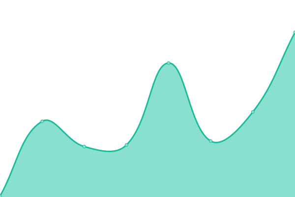
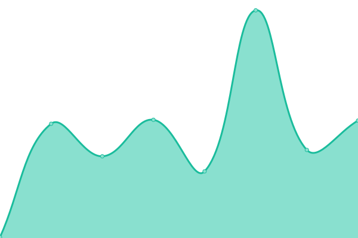
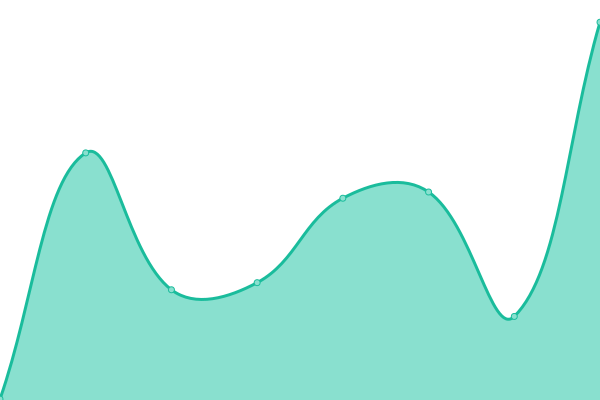
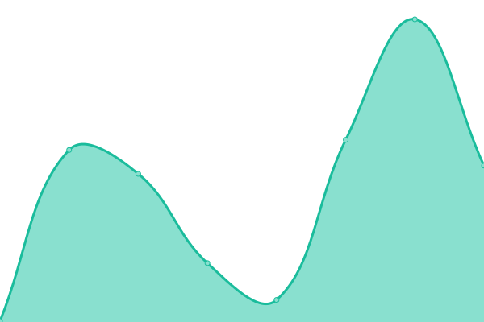
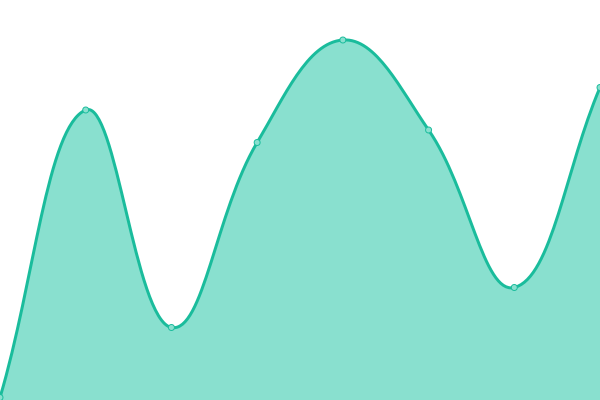

# [📈 Live Status](https://demo.upptime.js.org): <!--live status--> **🟩 All systems operational**

This repository contains the open-source uptime monitor and status page for [seanstaffiery.com](https://demo.upptime.js.org), powered by [Upptime](https://github.com/upptime/upptime).

With [Upptime](https://upptime.js.org), you can get your own unlimited and free uptime monitor and status page, powered entirely by a GitHub repository. We use [Issues](https://github.com/seanstaffiery.com/status.seanstaffiery.com/issues) as incident reports, [Actions](https://github.com/seanstaffiery.com/status.seanstaffiery.com/actions) as uptime monitors, and [Pages](https://demo.upptime.js.org) for the status page.

<!--start: status pages-->
<!-- This summary is generated by Upptime (https://github.com/upptime/upptime) -->
<!-- Do not edit this manually, your changes will be overwritten -->
<!-- prettier-ignore -->
| URL | Status | History | Response Time | Uptime |
| --- | ------ | ------- | ------------- | ------ |
|  [DigitalOcean](https://digitalocean.com) | 🟩 Up | [digital-ocean.yml](https://github.com/SeanStaffiery/status.seanstaffiery.com/commits/HEAD/history/digital-ocean.yml) | 

 171ms
     
 | 

<a href="https://status.seanstaffiery.com/history/digital-ocean">100.00%</a>
    

|  [Cloudflare](https://www.cloudflare.com) | 🟩 Up | [cloudflare.yml](https://github.com/SeanStaffiery/status.seanstaffiery.com/commits/HEAD/history/cloudflare.yml) | 

 347ms
     
 | 

<a href="https://status.seanstaffiery.com/history/cloudflare">100.00%</a>
    

|  [Zoho](https://zoho.com) | 🟩 Up | [zoho.yml](https://github.com/SeanStaffiery/status.seanstaffiery.com/commits/HEAD/history/zoho.yml) | 

 822ms
     
 | 

<a href="https://status.seanstaffiery.com/history/zoho">100.00%</a>
    

|  [Proofpoint](https://proofpoint.com) | 🟩 Up | [proofpoint.yml](https://github.com/SeanStaffiery/status.seanstaffiery.com/commits/HEAD/history/proofpoint.yml) | 

 238ms
     
 | 

<a href="https://status.seanstaffiery.com/history/proofpoint">100.00%</a>
    

|  [SendGrid](https://sendgrid.com) | 🟩 Up | [send-grid.yml](https://github.com/SeanStaffiery/status.seanstaffiery.com/commits/HEAD/history/send-grid.yml) | 

 482ms
     
 | 

<a href="https://status.seanstaffiery.com/history/send-grid">100.00%</a>
    

|  [Red Sift](https://redsift.com) | 🟩 Up | [red-sift.yml](https://github.com/SeanStaffiery/status.seanstaffiery.com/commits/HEAD/history/red-sift.yml) | 

 178ms
     
 | 

<a href="https://status.seanstaffiery.com/history/red-sift">99.77%</a>
    

|  [Microsoft Azure (Azure)](https://azure.com) | 🟩 Up | [microsoft-azure-azure.yml](https://github.com/SeanStaffiery/status.seanstaffiery.com/commits/HEAD/history/microsoft-azure-azure.yml) | 

 5291ms
     
 | 

<a href="https://status.seanstaffiery.com/history/microsoft-azure-azure">100.00%</a>
    

|  [Google Cloud Platform (GCP)](https://cloud.google.com) | 🟩 Up | [google-cloud-platform-gcp.yml](https://github.com/SeanStaffiery/status.seanstaffiery.com/commits/HEAD/history/google-cloud-platform-gcp.yml) | 

 345ms
     
 | 

<a href="https://status.seanstaffiery.com/history/google-cloud-platform-gcp">100.00%</a>
    

|  [Amazon Web Services (AWS)](https://aws.amazon.com) | 🟩 Up | [amazon-web-services-aws.yml](https://github.com/SeanStaffiery/status.seanstaffiery.com/commits/HEAD/history/amazon-web-services-aws.yml) | 

 728ms
     
 | 

<a href="https://status.seanstaffiery.com/history/amazon-web-services-aws">100.00%</a>
    

|  [Oracle Cloud](https://cloud.oracle.com) | 🟩 Up | [oracle-cloud.yml](https://github.com/SeanStaffiery/status.seanstaffiery.com/commits/HEAD/history/oracle-cloud.yml) | 

 193ms
     
 | 

<a href="https://status.seanstaffiery.com/history/oracle-cloud">100.00%</a>
    

|  [Firebase](https://firebase.google.com) | 🟩 Up | [firebase.yml](https://github.com/SeanStaffiery/status.seanstaffiery.com/commits/HEAD/history/firebase.yml) | 

 387ms
     
 | 

<a href="https://status.seanstaffiery.com/history/firebase">99.81%</a>
    

|  [Squarespace](https://www.squarespace.com) | 🟩 Up | [squarespace.yml](https://github.com/SeanStaffiery/status.seanstaffiery.com/commits/HEAD/history/squarespace.yml) | 

 330ms
     
 | 

<a href="https://status.seanstaffiery.com/history/squarespace">100.00%</a>
    

|  [Square](https://squareup.com) | 🟩 Up | [square.yml](https://github.com/SeanStaffiery/status.seanstaffiery.com/commits/HEAD/history/square.yml) | 

 166ms
     
 | 

<a href="https://status.seanstaffiery.com/history/square">100.00%</a>
    

|  [Stripe](https://stripe.com) | 🟩 Up | [stripe.yml](https://github.com/SeanStaffiery/status.seanstaffiery.com/commits/HEAD/history/stripe.yml) | 

 212ms
     
 | 

<a href="https://status.seanstaffiery.com/history/stripe">100.00%</a>
    

|  [GitHub](https://github.com) | 🟩 Up | [git-hub.yml](https://github.com/SeanStaffiery/status.seanstaffiery.com/commits/HEAD/history/git-hub.yml) | 

 211ms
     
 | 

<a href="https://status.seanstaffiery.com/history/git-hub">100.00%</a>
    

|  [Netlify](https://www.netlify.com) | 🟩 Up | [netlify.yml](https://github.com/SeanStaffiery/status.seanstaffiery.com/commits/HEAD/history/netlify.yml) | 

 110ms
     
 | 

<a href="https://status.seanstaffiery.com/history/netlify">100.00%</a>
    

|  [Vercel](https://vercel.com) | 🟩 Up | [vercel.yml](https://github.com/SeanStaffiery/status.seanstaffiery.com/commits/HEAD/history/vercel.yml) | 

 114ms
     
 | 

<a href="https://status.seanstaffiery.com/history/vercel">100.00%</a>
    

|  [Termly](https://termly.io) | 🟩 Up | [termly.yml](https://github.com/SeanStaffiery/status.seanstaffiery.com/commits/HEAD/history/termly.yml) | 

 134ms
     
 | 

<a href="https://status.seanstaffiery.com/history/termly">100.00%</a>
    

<!--end: status pages-->

[**Visit our status website →**](https://demo.upptime.js.org)

## 📄 License

- Powered by: [Upptime](https://github.com/upptime/upptime)
- Code: [MIT](./LICENSE) © [seanstaffiery.com](https://demo.upptime.js.org)
- Data in the `./history` directory: [Open Database License](https://opendatacommons.org/licenses/odbl/1-0/)
