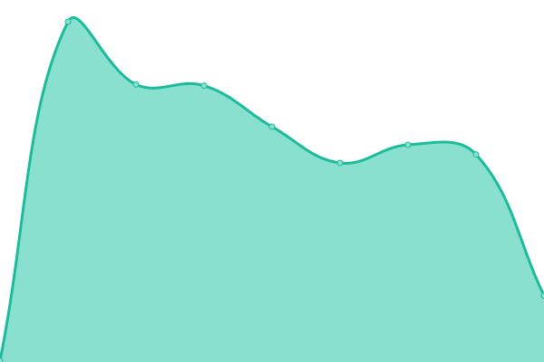

# [📈 Live Status](https://demo.upptime.js.org): <!--live status--> **🟧 Partial outage**

This repository contains the open-source uptime monitor and status page for [seanstaffiery.com](https://demo.upptime.js.org), powered by [Upptime](https://github.com/upptime/upptime).

With [Upptime](https://upptime.js.org), you can get your own unlimited and free uptime monitor and status page, powered entirely by a GitHub repository. We use [Issues](https://github.com/seanstaffiery.com/status.seanstaffiery.com/issues) as incident reports, [Actions](https://github.com/seanstaffiery.com/status.seanstaffiery.com/actions) as uptime monitors, and [Pages](https://demo.upptime.js.org) for the status page.

<!--start: status pages-->
<!-- This summary is generated by Upptime (https://github.com/upptime/upptime) -->
<!-- Do not edit this manually, your changes will be overwritten -->
<!-- prettier-ignore -->
| URL | Status | History | Response Time | Uptime |
| --- | ------ | ------- | ------------- | ------ |
|  [Central Website - seanstaffiery.com](https://seanstaffiery.com) | 🟩 Up | [central-website-seanstaffiery-com.yml](https://github.com/SeanStaffiery/status.seanstaffiery.com/commits/HEAD/history/central-website-seanstaffiery-com.yml) | 

 352ms
     
 | 

<a href="https://status.seanstaffiery.com/history/central-website-seanstaffiery-com">100.00%</a>
    

|  [File Server - files.seanstaffiery.com](https://files.seanstaffiery.com) | 🟩 Up | [file-server-files-seanstaffiery-com.yml](https://github.com/SeanStaffiery/status.seanstaffiery.com/commits/HEAD/history/file-server-files-seanstaffiery-com.yml) | 

 168ms
     
 | 

<a href="https://status.seanstaffiery.com/history/file-server-files-seanstaffiery-com">100.00%</a>
    

|  [Flarum Forum - forum.seanstaffiery.com](https://forum.seanstaffiery.com) | 🟩 Up | [flarum-forum-forum-seanstaffiery-com.yml](https://github.com/SeanStaffiery/status.seanstaffiery.com/commits/HEAD/history/flarum-forum-forum-seanstaffiery-com.yml) | 

 343ms
     
 | 

<a href="https://status.seanstaffiery.com/history/flarum-forum-forum-seanstaffiery-com">100.00%</a>
    

|  [Projects Website - projects.seanstaffiery.com](https://projects.seanstaffiery.com) | 🟩 Up | [projects-website-projects-seanstaffiery-com.yml](https://github.com/SeanStaffiery/status.seanstaffiery.com/commits/HEAD/history/projects-website-projects-seanstaffiery-com.yml) | 

 279ms
     
 | 

<a href="https://status.seanstaffiery.com/history/projects-website-projects-seanstaffiery-com">100.00%</a>
    

|  [PGP Fingerprints - pgp.seanstaffiery.com](https://pgp.seanstaffiery.com) | 🟩 Up | [pgp-fingerprints-pgp-seanstaffiery-com.yml](https://github.com/SeanStaffiery/status.seanstaffiery.com/commits/HEAD/history/pgp-fingerprints-pgp-seanstaffiery-com.yml) | 

 123ms
     
 | 

<a href="https://status.seanstaffiery.com/history/pgp-fingerprints-pgp-seanstaffiery-com">100.00%</a>
    

|  [NextCloud - home.seanstaffiery.com](https://home.seanstaffiery.com) | 🟩 Up | [next-cloud-home-seanstaffiery-com.yml](https://github.com/SeanStaffiery/status.seanstaffiery.com/commits/HEAD/history/next-cloud-home-seanstaffiery-com.yml) | 

 618ms
     
 | 

<a href="https://status.seanstaffiery.com/history/next-cloud-home-seanstaffiery-com">100.00%</a>
    

|  [Development Blog - blog.seanstaffiery.com](https://blog.seanstaffiery.com) | 🟩 Up | [development-blog-blog-seanstaffiery-com.yml](https://github.com/SeanStaffiery/status.seanstaffiery.com/commits/HEAD/history/development-blog-blog-seanstaffiery-com.yml) | 

 176ms
     
 | 

<a href="https://status.seanstaffiery.com/history/development-blog-blog-seanstaffiery-com">100.00%</a>
    

|  [Resume Website - seanstaffiery.dev](https://seanstaffiery.dev) | 🟩 Up | [resume-website-seanstaffiery-dev.yml](https://github.com/SeanStaffiery/status.seanstaffiery.com/commits/HEAD/history/resume-website-seanstaffiery-dev.yml) | 

 311ms
     
 | 

<a href="https://status.seanstaffiery.com/history/resume-website-seanstaffiery-dev">100.00%</a>
    

|  [Repository - seanstaffiery.net](https://seanstaffiery.net) | 🟩 Up | [repository-seanstaffiery-net.yml](https://github.com/SeanStaffiery/status.seanstaffiery.com/commits/HEAD/history/repository-seanstaffiery-net.yml) | 

 794ms
     
 | 

<a href="https://status.seanstaffiery.com/history/repository-seanstaffiery-net">100.00%</a>
    

|  [Family Website - thehosmers.com](https://thehosmers.com) | 🟩 Up | [family-website-thehosmers-com.yml](https://github.com/SeanStaffiery/status.seanstaffiery.com/commits/HEAD/history/family-website-thehosmers-com.yml) | 

 249ms
     
 | 

<a href="https://status.seanstaffiery.com/history/family-website-thehosmers-com">100.00%</a>
    

|  [IPFS Central Site - ipfs.io](https://ipfs.io) | 🟩 Up | [ipfs-central-site-ipfs-io.yml](https://github.com/SeanStaffiery/status.seanstaffiery.com/commits/HEAD/history/ipfs-central-site-ipfs-io.yml) | 

 132ms
     
 | 

<a href="https://status.seanstaffiery.com/history/ipfs-central-site-ipfs-io">99.82%</a>
    

|  [IPFS Gateway 1/2](https://ipfs.seanstaffiery.com) | 🟥 Down | [ipfs-gateway-1-2.yml](https://github.com/SeanStaffiery/status.seanstaffiery.com/commits/HEAD/history/ipfs-gateway-1-2.yml) | 

 6351ms
     
 | 

<a href="https://status.seanstaffiery.com/history/ipfs-gateway-1-2">90.00%</a>
    

|  [IPFS Gateway 2/2](https://ipfs.seanstaffiery.dev) | 🟩 Up | [ipfs-gateway-2-2.yml](https://github.com/SeanStaffiery/status.seanstaffiery.com/commits/HEAD/history/ipfs-gateway-2-2.yml) | 

 5725ms
     
 | 

<a href="https://status.seanstaffiery.com/history/ipfs-gateway-2-2">88.00%</a>
    

|  [DigitalOcean](https://digitalocean.com) | 🟩 Up | [digital-ocean.yml](https://github.com/SeanStaffiery/status.seanstaffiery.com/commits/HEAD/history/digital-ocean.yml) | 

 219ms
     
 | 

<a href="https://status.seanstaffiery.com/history/digital-ocean">100.00%</a>
    

|  [Cloudflare](https://www.cloudflare.com) | 🟩 Up | [cloudflare.yml](https://github.com/SeanStaffiery/status.seanstaffiery.com/commits/HEAD/history/cloudflare.yml) | 

 102ms
     
 | 

<a href="https://status.seanstaffiery.com/history/cloudflare">100.00%</a>
    

|  [Zoho](https://zoho.com) | 🟩 Up | [zoho.yml](https://github.com/SeanStaffiery/status.seanstaffiery.com/commits/HEAD/history/zoho.yml) | 

 549ms
     
 | 

<a href="https://status.seanstaffiery.com/history/zoho">100.00%</a>
    

|  [Proofpoint](https://proofpoint.com) | 🟩 Up | [proofpoint.yml](https://github.com/SeanStaffiery/status.seanstaffiery.com/commits/HEAD/history/proofpoint.yml) | 

 574ms
     
 | 

<a href="https://status.seanstaffiery.com/history/proofpoint">100.00%</a>
    

|  [Microsoft Azure (Azure)](https://azure.com) | 🟩 Up | [microsoft-azure-azure.yml](https://github.com/SeanStaffiery/status.seanstaffiery.com/commits/HEAD/history/microsoft-azure-azure.yml) | 

 806ms
     
 | 

<a href="https://status.seanstaffiery.com/history/microsoft-azure-azure">100.00%</a>
    

|  [Google Cloud Platform (GCP)](https://cloud.google.com) | 🟩 Up | [google-cloud-platform-gcp.yml](https://github.com/SeanStaffiery/status.seanstaffiery.com/commits/HEAD/history/google-cloud-platform-gcp.yml) | 

 4672ms
     
 | 

<a href="https://status.seanstaffiery.com/history/google-cloud-platform-gcp">100.00%</a>
    

|  [Amazon Web Services (AWS)](https://aws.amazon.com) | 🟩 Up | [amazon-web-services-aws.yml](https://github.com/SeanStaffiery/status.seanstaffiery.com/commits/HEAD/history/amazon-web-services-aws.yml) | 

 368ms
     
 | 

<a href="https://status.seanstaffiery.com/history/amazon-web-services-aws">100.00%</a>
    

|  [Firebase](https://firebase.google.com) | 🟩 Up | [firebase.yml](https://github.com/SeanStaffiery/status.seanstaffiery.com/commits/HEAD/history/firebase.yml) | 

 397ms
     
 | 

<a href="https://status.seanstaffiery.com/history/firebase">100.00%</a>
    

|  [GitHub](https://github.com) | 🟩 Up | [git-hub.yml](https://github.com/SeanStaffiery/status.seanstaffiery.com/commits/HEAD/history/git-hub.yml) | 

 287ms
     
 | 

<a href="https://status.seanstaffiery.com/history/git-hub">100.00%</a>
    

<!--end: status pages-->

[**Visit our status website →**](https://demo.upptime.js.org)

## 📄 License

- Powered by: [Upptime](https://github.com/upptime/upptime)
- Code: [MIT](./LICENSE) © [seanstaffiery.com](https://demo.upptime.js.org)
- Data in the `./history` directory: [Open Database License](https://opendatacommons.org/licenses/odbl/1-0/)
